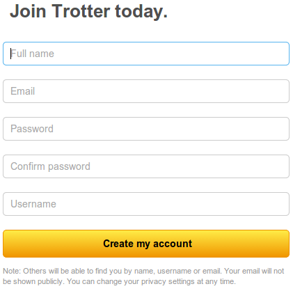
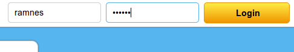
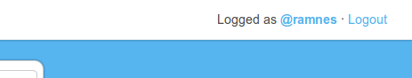
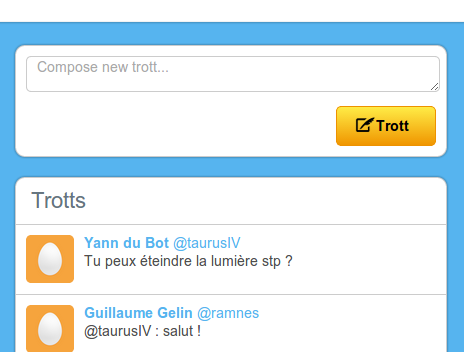
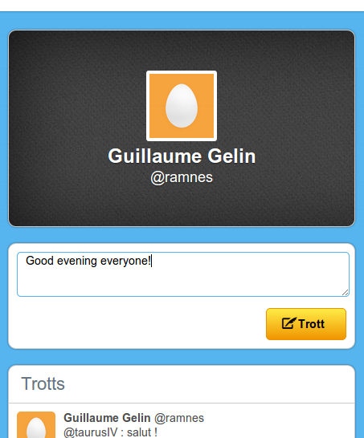
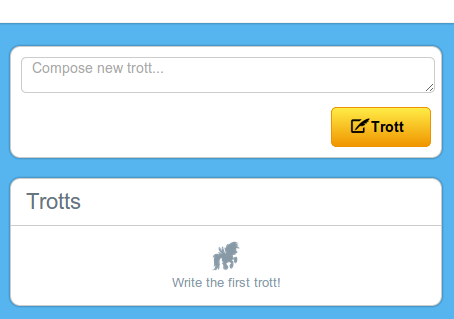
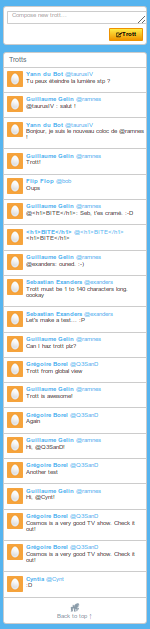
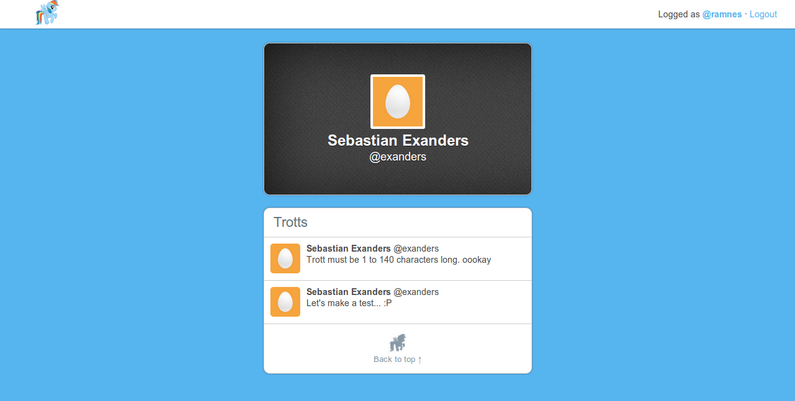
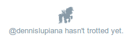

# Trotter

[trott.herokuapp.com](http://trott.herokuapp.com)

Just another basic clone of Twitter, built for fun with Ruby on Rails.

* [What is Trotter](#what-is-trotter)
* [Technologies used](#technologies-used)
* [Key features](#key-features)
  * [Registration](#registration)
  * [Sessions](#sessions)
  * [Trotting](#trotting)
  * [Trotts index](#trotts-index)
  * [Profiles](#profiles)
* [End note](#end-note)


## What is Trotter

The idea behind it was to get an experience the closer possible to the real
Twitter, by creating a micro-blogging website where people can register and
express themselves by sending messages that must be shorter than 140 characters.

Concerning the visual identity, the bird of Twitter is replaced by a magic pony,
and that is why the application is called Trotter.  A *tweet* becomes a
*trott*.


## Technologies used

Trotter uses Ruby on Rails, PostgreSQL as database, LESS, and that's all. The
project follow an international development method called KISS: "Keep It Super
Simple".


## Key features

### Registration

Twitter is not anonymous, so Trotter had to implement user registration also.
The registration form is super intuitive for every Twitter user, since it is
almost exactly the same (actually, Trotter one is better).




### Sessions

Being able to register is great, but it is even greater if you can use your
account and login without having to register again.

I implemented sessions by creating a session controller and using the session
value everywhere I needed a different behaviour whether the user is logged or
anonymous.

For example, the code below makes that the default main page for an anonymous
user will be the registration page – */users/new* – whereas it will be the trotts
index – */trotts* – for a registered user, since the default root page is set to
*/users/new*.

```ruby
class UsersController < ApplicationController
  def new
    @user = User.new
    if session[:current_user_id]
      redirect_to Trott
    end
  end
```

In a similar way, an anonymous user can login by filling the top bar form. If
the user is already logged, the form will be replaced by some information about
the current user and a logout button that will destroy the current session.






### Trotting

Obviously, trotting is the main feature of Trotter. By *trotting*, we mean sending
a *trott*, a 140 characters message.

A trott can be done once logged on Trotter, from different places: directly on
the user profile, or in the trotts index.






### Trotts index

The trotts index is where all trotts are referenced. At the creation of Trotter,
this index is empty, so it just look like this:



But then, when people start trotting, it's much more fun:



Every trotter profile is accessible by a link on top of the trott, so people can
easily go to other people profiles and see their owns trotts.


### Profiles

Profiles are the place where we can see a user informations and its own
trotts. Every profile is public, so every Trotter user can see it, but also any
anonymous visitor.




## End note

Please don't take all of this seriously.


